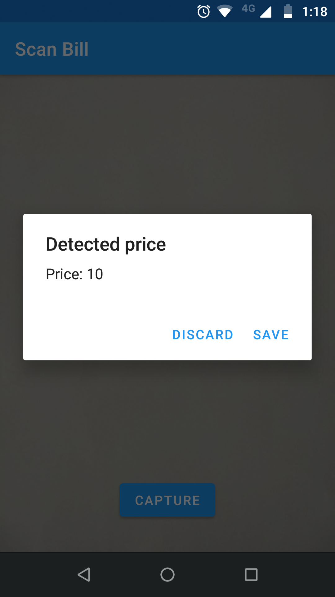

# Mobile Vision

An android application to detect, store and display amount on a bill using the Mobile Vision API.


## Getting Started

Clone this repository and open it in Android Studio or use "Import Project from Version Control" in Android Studio and paste the following link

```
https://github.com/DhanaSekharM/WebClubTasks.git
```


## Screenshots

   


## References and Libraries Used


- [Mobile Vision](https://developers.google.com/android/reference/com/google/android/gms/vision/package-summary) - An API that can detect objects(like text, barcodes and faces) in photos and videos.
- [Room](https://developer.android.com/topic/libraries/architecture/room) - The Room persistence library provides an abstraction over SQLite to allow for more robust            access to the app's SQLite database with in-app objects.
- [Mobile Vision Text API Codelabs](https://codelabs.developers.google.com/codelabs/mobile-vision-ocr/#0) - Codelabs tutorial on OCR with the Mobile Vision's Text API.
- [Google sample app](https://github.com/googlesamples/android-vision) - A sample app to demonstrate the Mobile Vision API


